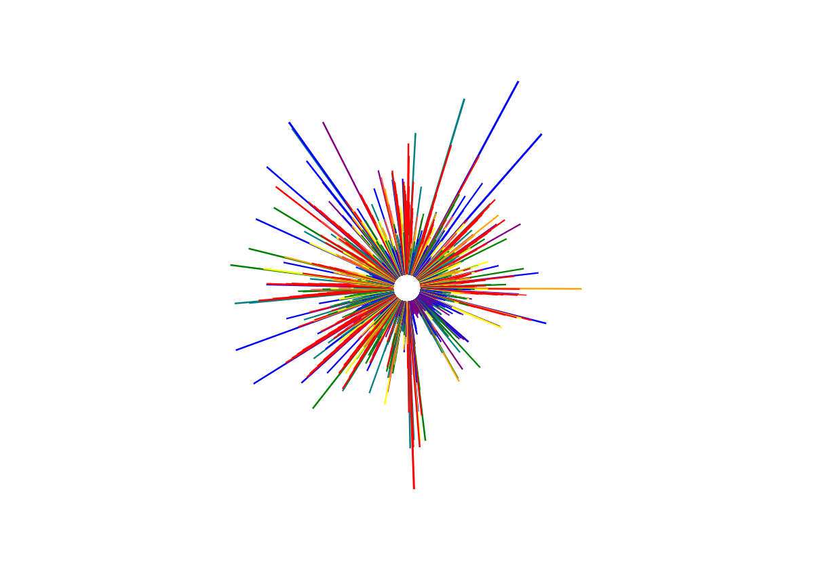

# MusicVisualizer
Using a Nodemcu ESP8266, MAX4466, and RGB LED it will translate music and upload to a server. The server code is in a PHP Symfony5 application and visualized with the HTML5 canvas tag.

Sample output:

